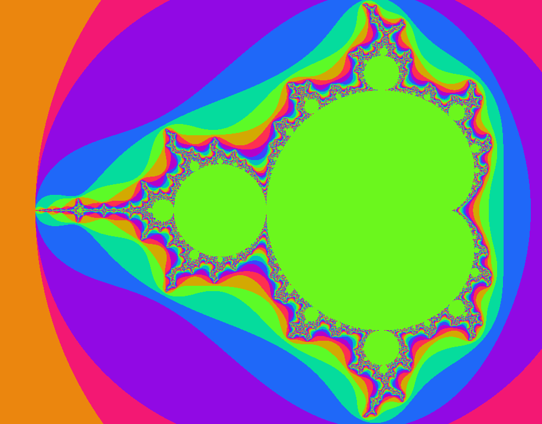
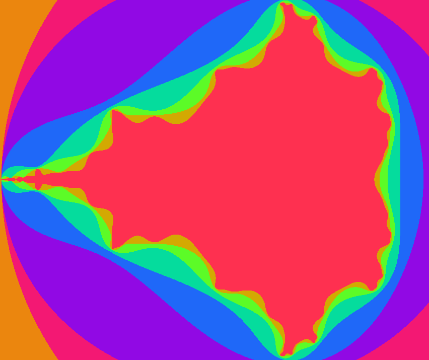

# Interactive Mandelbrot Set display using Rust, SDL2 and OpenGL
## Created by: Tóth Bálint, University of Pannonia, 2023 <toth.balint1225@gmail.com>
---

## Try out yourself
Required:
- Cargo and [Rust Toolchain](https://www.rust-lang.org/tools/install)
- Development libraries for SDL2 for your specific operating system. Detailed install instructions on [SDL2's cargo page](https://crates.io/crates/sdl2)

To Compile the program call `cargo build` from the root directory of the repository.

## How to use
To run the program, call `cargo run` from the root directory of the repository.
After the program starts, you are presented with a fullscreen image of the Mandelbrot set with a low number (2 by default) of iterations simulating the fractal.
To increase the number of iterations on each pixel, hence the resolution of the fractal, use the `q` key on your keyboard. 
To decrease the iteration count, use the `e` key.
To navigate in the image use the `w`, `a`, `s` and `d` keys, and for zooming in and out, use the `<space>` and `<left shift>` keys.

## Sample

## How it works - Mandelbrot set and parallelism on a GPU
The mandelbrot set is defined by the set of all complex number c, where f(z) = z^2 + c is convergent starting from z = 0. Since complex numbers can be represented on a plane, an image can be generated by approximating the convergence of f(z) for every c in the view space and z from 0 to infinity or in our case an arbitrarily set maximum iteration count. These points will create a shape with a rather interresting border that form a fractal curve[1][1]. For simplicity, convergence can be checked with an iteration and an approximated limit value. 

This iteration is extremely costly, it creates a terribly slow and laggy animation so the only way to improve the situation is to use parallel programming. In the parrallel case on a CPU the distribution of tasks between threads is rather complicated, because the set is not symmetric meaning no matter how you divide the image between CPU threads, there will be ones that finish the computation before others resulting in a flickering animation. Ideally we would use a separate thread for every pixel on our screen, but CPU-s are limited in that regard. Fortunatelly GPU cards are designed specifically for this kind of task.

In the OpenGL graphics pipeline we can use different GPU programs, so called shaders, to modify the behaviour of the display of the given graphical elements, the most important two kinds for us now are vertex and fragment shaders. The vertex shader is responsible for any computation that maps verteices to other vertices [2][2]. However for this program the more importat one is the fragment shader. After the pipeline rasterises the given graphics, it creates a fragment with a screen space position, depth and color [3][3]. In our case the depth and color parameters are not important, but consider the scenario, where we fill in the whole screen space with a rectangle and access the coordinates as points in the complex plane, scaled down to the desired viewport by OpenGL. At this point we have access to a quite powerful parallel system that can dynamically act on the color of individual pixels. The program uses the fragment shader to compute the convergence criterion for the Mandelbrot set and setting the individual color of the pixel, resulting in a highly parallel solution to the aforementoned problem. In conclusion, with the simple hack of using the graphics pipeline itself to calculate both the Mandelbrot set criteria and the color of the image, a simple parallel method was created resulting in a fast, reliable and smooth animation.

[1]: https://en.wikipedia.org/wiki/Mandelbrot_set "Wikipedia" 
[2]: https://www.khronos.org/opengl/wiki/Vertex_Shader "Vertex Shader"
[3]: https://www.khronos.org/opengl/wiki/Fragment_Shader "Fragment Shader"

## Useful resources
The OpenGL handling code and the abstractions implemented in rust are based on the [OpenGL tutorials of Victor Gordan](https://www.youtube.com/playlist?list=PLPaoO-vpZnumdcb4tZc4x5Q-v7CkrQ6M-). The coloration and the parallelisation background idea originates from [this video from javidx9](https://www.youtube.com/watch?v=PBvLs88hvJ8&t=2776s). Both are great resources for learning some interesting concepts like OpenGL and computer graphics, I used them to create my own abstactions and driver code in Rust, using the language's trait and struct system. For a more in-depth explanation of OpenGL and Mandelbrot set visualisation, check out these videos.
